# DESPLIEGUE — Evidencias y respuestas

Este documento recopila todas las evidencias y respuestas de la practica.

---

## Parte 1 — Evidencias minimas

### Fase 1: Instalacion y configuracion

1) Servicio Nginx activo
- Que demuestra: Que el contenedor `f41_nginx` está levantado, el proceso maestro de Nginx está en ejecución y el puerto 80 interno está publicado en el 8080 del host.
- Comando: `docker compose ps` y `docker exec -it nginx-web service nginx status`
- Evidencia:


2) Configuracion cargada
- Que demuestra: Que el archivo `default.conf` se ha montado correctamente en el contenedor y Nginx lo está usando sin errores de sintaxis. 
- Comando: `docker compose exec nginx ls -la /etc/nginx/conf.d`
- Evidencia:


3) Resolucion de nombres
- Que demuestra: Que el nombre configurado (fran.static en /etc/hosts) resuelve correctamente hacia el servicio web en lugar de usar IP directa.
- Evidencia:


4) Contenido Web
- Que demuestra: Que la web principal (Cloud Academy) está desplegada en la raíz del documento (/usr/share/nginx/html) y se sirve correctamente por HTTP(S).
- Evidencia:


### Fase 2: Transferencia SFTP (Filezilla)

5) Conexion SFTP exitosa
- Que demuestra:  Que el servicio `f41_sftp` está accesible por SFTP en localhost:2222 y las credenciales configuradas funcionan.
- Evidencia:


6) Permisos de escritura
- Que demuestra: Que el usuario SFTP tiene permisos de escritura sobre el directorio compartido (`/home/sftpuser/upload` ↔ `./site`) y puede subir archivos sin errores.
- Evidencia:


### Fase 3: Infraestructura Docker

7) Contenedores activos
- Que demuestra: Que los servicios `f41_nginx` y `f41_sftp` están ambos en estado Up y con los puertos publicados (8080:80, 8443:443, 2222:22).
- Comando: `docker compose ps`
- Evidencia:


8) Persistencia (Volumen compartido)
- Que demuestra: Que el volumen/bind mount `./site` es común a ambos servicios y cualquier archivo subido por SFTP se ve inmediatamente desde Nginx.
- Evidencia:


9) Despliegue multi-sitio
- Que demuestra: Que la segunda web está desplegada en `./site/reloj` y el bloque `location /reloj/ { alias ... }` funciona sirviendo http://localhost:8080/reloj/.
- Evidencia: 


### Fase 4: Seguridad HTTPS

10) Cifrado SSL
- Que demuestra: Que Nginx está escuchando en 443 con los certificados autofirmados configurados y el sitio es accesible por HTTPS (mapeado a 8443 en el host).
- Evidencia:


11) Redireccion forzada
- Que demuestra: Que el bloque `server` en puerto 80 devuelve un 301 hacia la versión HTTPS, forzando el uso de conexión cifrada.
- Evidencia:


---

## Parte 2 — Evaluacion RA2 (a–j)

### a) Parametros de administracion
- Respuesta:

Contenido de nginx.conf:

```bash
user  nginx;
worker_processes  auto;

error_log  /var/log/nginx/error.log notice;
pid        /run/nginx.pid;


events {
    worker_connections  1024;
}


http {
    include       /etc/nginx/mime.types;
    default_type  application/octet-stream;

    log_format  main  '$remote_addr - $remote_user [$time_local] "$request" '
                      '$status $body_bytes_sent "$http_referer" '
                      '"$http_user_agent" "$http_x_forwarded_for"';

    access_log  /var/log/nginx/access.log  main;

    sendfile        on;
    #tcp_nopush     on;

    keepalive_timeout  65;

    #gzip  on;

    include /etc/nginx/conf.d/*.conf;
}
```

Las directivas en `nginx.conf` controlan el comportamiento del motor:
- `worker_processes`: Define cuántos procesos worker se lanzan (normalmente igual al número de CPUs). *Configuración incorrecta:* Poner 100 en un sistema de 1 CPU (causa sobrecarga por cambio de contexto).
- `worker_connections`: Máximo de conexiones simultáneas por worker. *Configuración incorrecta:* Poner un número mayor al límite de descriptores de archivos del SO.
- `access_log` / `error_log`: Rutas de registro.
- `keepalive_timeout`: Tiempo que una conexión permanece abierta.
- `include`: Carga archivos de configuración externos.
- `gzip`: Activa la compresión.

 **Cambio aplicado:** He ajustado el `keepalive_timeout` a `30` en el archivo `default.conf` para optimizar la liberación de recursos.

- Evidencias:
  - evidencias/a-01-grep-nginxconf.png
  - evidencias/a-02-nginx-t.png
  - evidencias/a-03-reload.png


### b) Ampliacion de funcionalidad + modulo investigado
- Opcion elegida (B1 o B2): B1 - Gzip
- Respuesta:

He creado un archivo `gzip.conf` con nivel de compresión 5 y tipos de archivos específicos para reducir el ancho de banda consumido por el sitio de Cloud Academy. He aplicado la configuración de Gzip mediante un bind mount en el `docker-compose.yml`. He aprovechado el volumen que mapea la carpeta local `./nginx/conf.d hacia /etc/nginx/conf.d` en el contenedor. Gracias a la directiva include del archivo principal de Nginx, cualquier archivo .conf que añada a esa carpeta (como `gzip.conf`) es procesado al arrancar o recargar el servicio.

- Evidencias (B1 o B2):
  - evidencias/b1-01-gzipconf.png
  - evidencias/b1-02-compose-volume-gzip.png
  - evidencias/b1-03-nginx-t.png
  - evidencias/b1-04-curl-gzip.png
  - evidencias/b2-01-defaultconf-headers.png
  - evidencias/b2-02-nginx-t.png
  - evidencias/b2-03-curl-https-headers.png

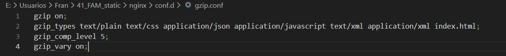
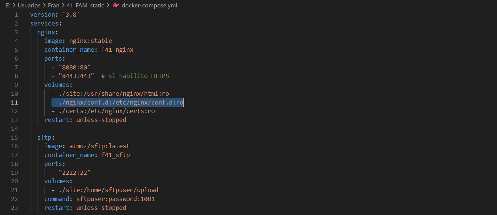
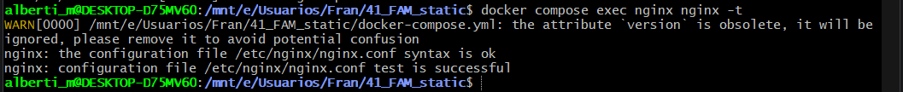
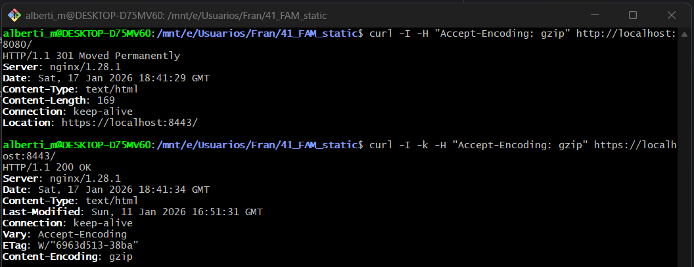

#### Modulo investigado: `ngx_http_stub_status_module`
- Para qué sirve: Proporciona acceso a métricas de estado básicas (conexiones activas, aceptadas, manejadas) de Nginx en tiempo real.
- Como se instala/carga: En la mayoría de distribuciones viene compilado por defecto. Se activa añadiendo un bloque `location /status { stub_status; }` en el archivo de configuración.
- Fuente(s): [Nginx Documentation - stub_status](https://nginx.org/en/docs/http/ngx_http_stub_status_module.html)

### c) Sitios virtuales / multi-sitio
- Respuesta:
  - **Diferencia:** El multi-sitio por **path** (usado aquí) sirve diferentes apps bajo el mismo dominio variando la URL (`/` vs `/reloj`). El multi-sitio por **nombre** (`server_name`) usa diferentes dominios (web1.com, web2.com) apuntando a la misma IP.
  - **Otros tipos:** Multi-sitio por **puerto** (8081 para app A, 8082 para app B) y por **IP** (si el servidor tiene varias interfaces de red).
  - **Configuración clave:** Se usa `alias` para `/reloj/` para que Nginx busque los archivos en una ruta absoluta fuera del `root` principal.
- Evidencias:
  - evidencias/c-01-root.png
  - evidencias/c-02-reloj.png
  - evidencias/c-03-defaultconf-inside.png

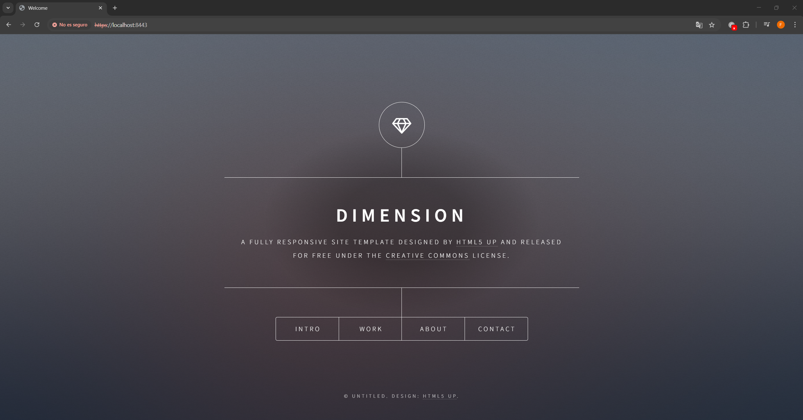
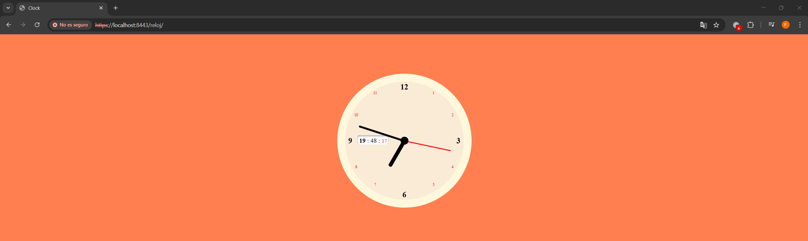
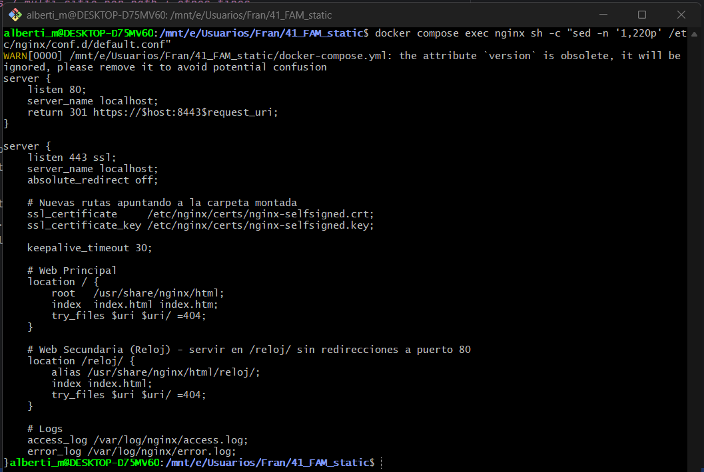

### d) Autenticacion y control de acceso
- Respuesta: He protegido la ruta `/admin` creando un directorio físico y configurando `auth_basic`. He generado el archivo `.htpasswd` con el usuario `admin`.
- Evidencias:
  - evidencias/d-01-admin-html.png
  - evidencias/d-02-defaultconf-auth.png
  - evidencias/d-03-curl-401.png
  - evidencias/d-04-curl-200.png

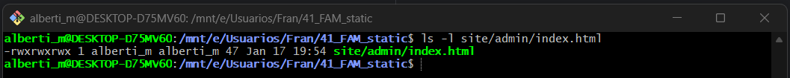
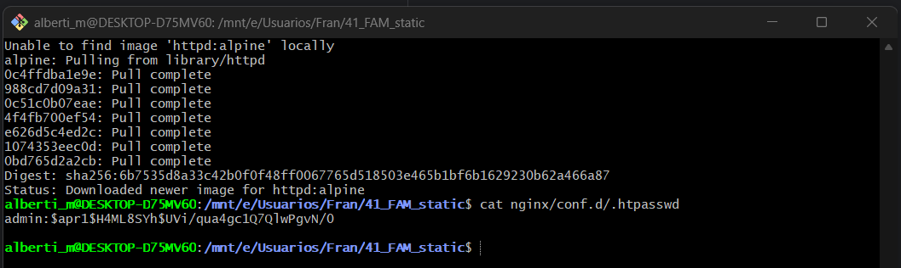
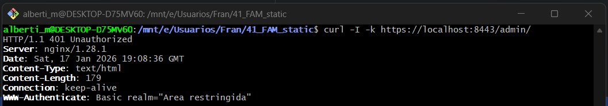
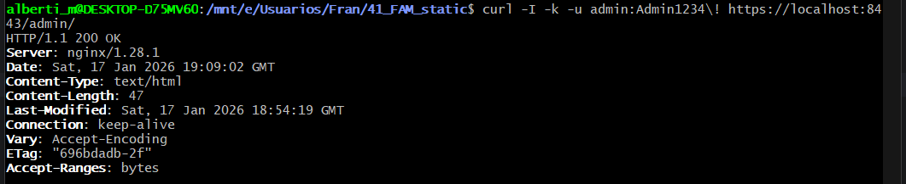

### e) Certificados digitales
- Respuesta:
  - **.crt vs .key:** El `.crt` es el certificado público que se envía al cliente; el `.key` es la clave privada que solo posee el servidor para descifrar la comunicación.
  - **-nodes:** Significa "no DES" (sin contraseña). Se usa en laboratorio para que Nginx pueda arrancar automáticamente sin pedir una clave cada vez que se levanta el contenedor.

- Evidencias:
  - evidencias/e-01-ls-certs.png
  - evidencias/e-02-compose-certs.png
  - evidencias/e-03-defaultconf-ssl.png

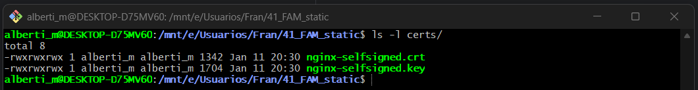
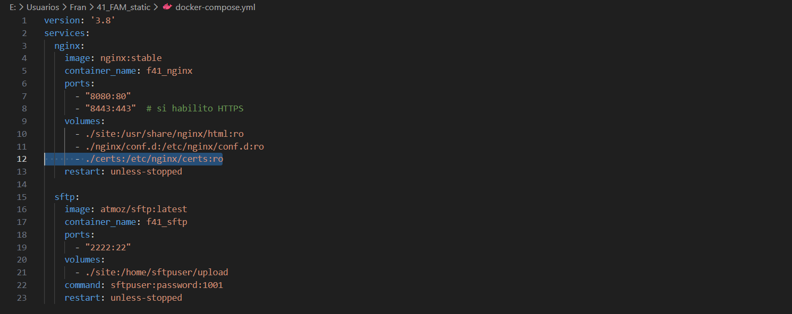
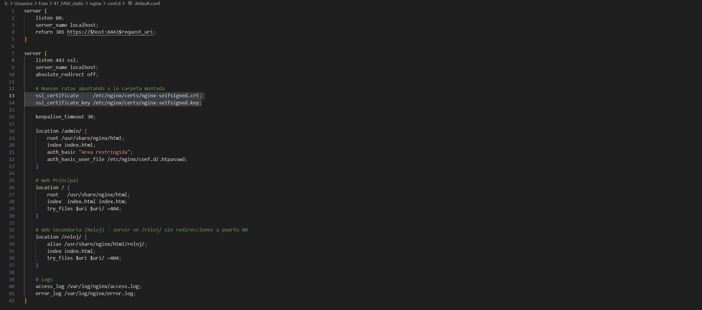

### f) Comunicaciones seguras
- Respuesta: Se utilizan dos bloques `server`: el del puerto 80 no tiene contenido, solo sirve como "puerta de entrada" para redirigir (301) a los usuarios al puerto seguro 443 (8443 en host), garantizando que nadie navegue de forma insegura.
- Evidencias:
  - evidencias/f-01-https.png
  - evidencias/f-02-301-network.png

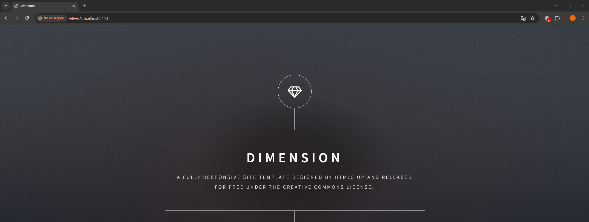
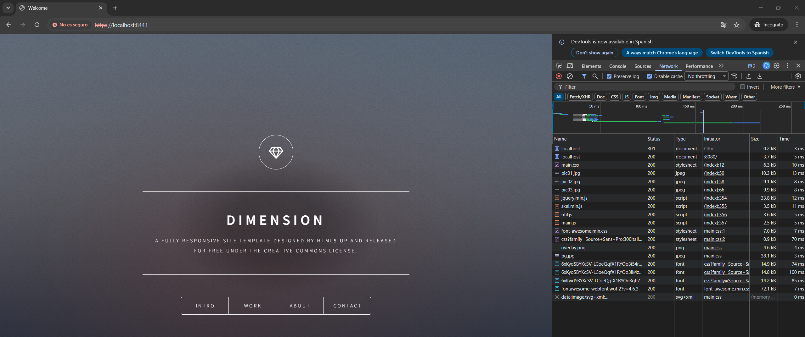

### g) Documentacion
- Respuesta: La infraestructura se basa en una red bridge de Docker. Nginx actúa como frontend web y SFTP como gestor de contenido, compartiendo el volumen `./site`. Se ha priorizado la seguridad mediante redirección forzosa HTTPS y la modularidad mediante `bind mounts`.
- Evidencias: este mismo documento `DESPLIEGUE.md` y las evidencias asociadas.

### h) Ajustes para implantacion de apps
- Respuesta:
1. Al desplegar en `/reloj`, es vital que los recursos (imágenes, CSS) tengan rutas relativas, de lo contrario intentarían cargarse desde la raíz `/`.
2. **Problema de permisos:** Al subir por SFTP, los archivos pueden pertenecer al UID del usuario SFTP (1001) y Nginx (www-data/101) no poder leerlos. **Solución:** Ajustar el UID en el comando del contenedor SFTP para que coincida o dar permisos 755 a las carpetas.
- Evidencias:
  - evidencias/h-01-root.png
  - evidencias/h-02-reloj.png

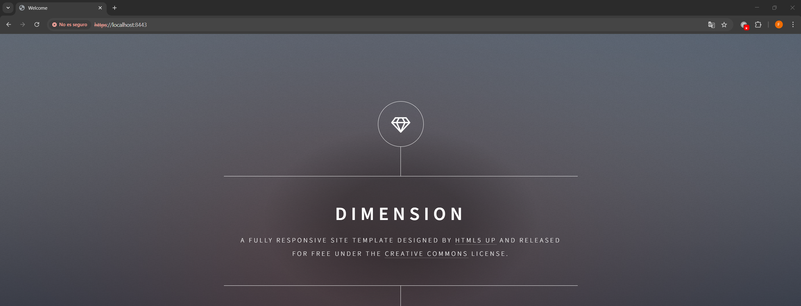
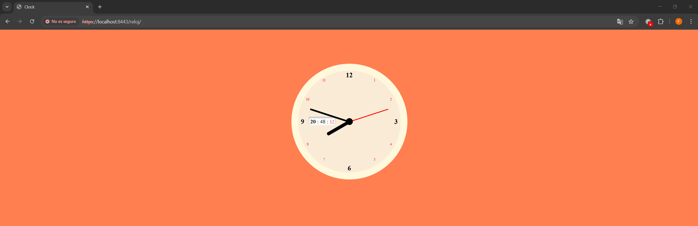

### i) Virtualizacion en despliegue
- Respuesta: 
  - **Nativa:** Requiere instalar paquetes en el SO host, difícil de migrar y de mantener versiones distintas.
  - **Contenedor:** El entorno es efímero. Si borro el contenedor y lo levanto de nuevo con el mismo `docker-compose.yml`, el servicio vuelve a estar idéntico. La configuración reside en el host y se inyecta por volúmenes, permitiendo portabilidad total.
- Evidencias:
  - evidencias/i-01-compose-ps.png

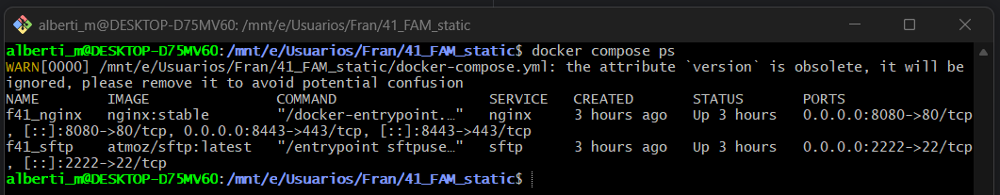

### j) Logs: monitorizacion y analisis
- Respuesta: He analizado los logs de Nginx filtrando por códigos de estado. Esto permite detectar ataques de fuerza bruta o enlaces rotos (404) rápidamente.
- Comandos utilizados:
  - `docker compose logs nginx | grep "GET" | awk '{print $9}' | sort | uniq -c | sort -nr | head -n 10`
  - `docker compose logs nginx | grep "GET" | awk '{print $11}' | sort | uniq -c | sort -nr`
  - `docker compose logs nginx | grep " 404 " | awk '{print $9}' | sort | uniq -c | sort -nr`

- Evidencias:
  - evidencias/j-01-logs-follow.png
  - evidencias/j-02-metricas.png


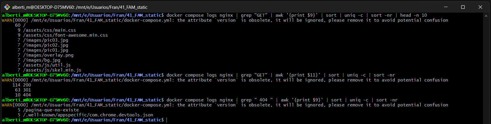
---

## Checklist final

### Parte 1
- [X] 1) Servicio Nginx activo
- [X] 2) Configuracion cargada
- [X] 3) Resolucion de nombres
- [X] 4) Contenido Web (Cloud Academy)
- [X] 5) Conexion SFTP exitosa
- [X] 6) Permisos de escritura
- [X] 7) Contenedores activos
- [X] 8) Persistencia (Volumen compartido)
- [X] 9) Despliegue multi-sitio (/reloj)
- [X] 10) Cifrado SSL
- [X] 11) Redireccion forzada (301)

### Parte 2 (RA2)
- [X] a) Parametros de administracion
- [X] b) Ampliacion de funcionalidad + modulo investigado
- [X] c) Sitios virtuales / multi-sitio
- [X] d) Autenticacion y control de acceso
- [X] e) Certificados digitales
- [X] f) Comunicaciones seguras
- [X] g) Documentacion
- [X] h) Ajustes para implantacion de apps
- [X] i) Virtualizacion en despliegue
- [X] j) Logs: monitorizacion y analisis
